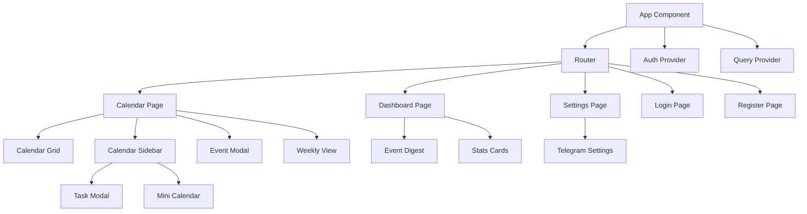
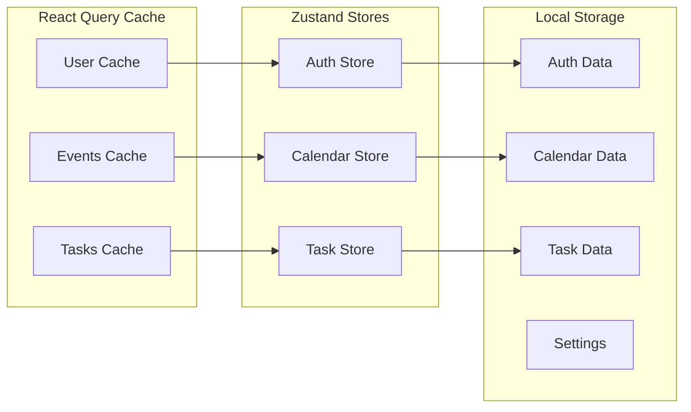
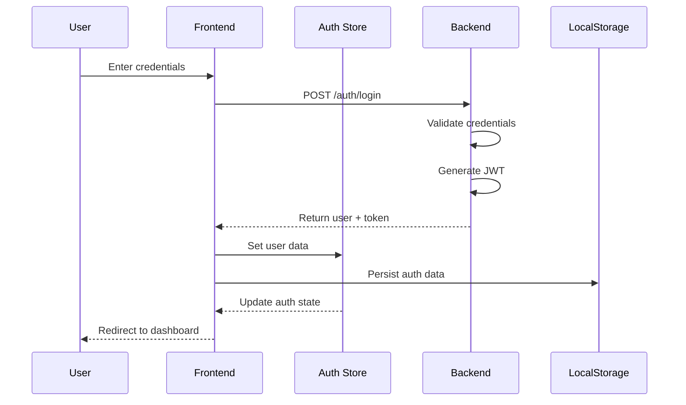
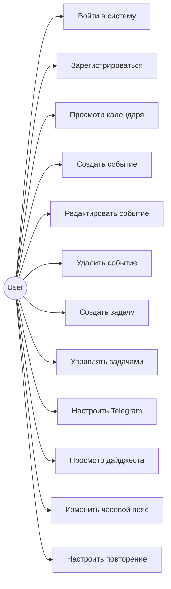

# Архитектура приложения "Календарь"

## Общая архитектура системы

```
┌─────────────────┐    ┌─────────────────┐    ┌─────────────────┐
│   Frontend      │    │   Backend       │    │   External      │
│   (React)       │    │   (Express.js)  │    │   Services      │
├─────────────────┤    ├─────────────────┤    ├─────────────────┤
│ • React Router  │◄──►│ • REST API      │◄──►│ • Telegram Bot  │
│ • Zustand       │    │ • JWT Auth      │    │ • Timezone API  │
│ • TailwindCSS   │    │ • MongoDB       │    │ • Email Service │
│ • React Query   │    │ • WebSocket     │    │                 │
└─────────────────┘    └─────────────────┘    └─────────────────┘
```

## Компонентная архитектура Frontend

### Структура папок

```
src/
├── components/          # Переиспользуемые компоненты
│   ├── ui/             # Базовые UI компоненты
│   ├── Calendar/       # Компоненты календаря
│   ├── Tasks/          # Компоненты задач
│   ├── Layout/         # Компоненты макета
│   └── Settings/       # Компоненты настроек
├── pages/              # Страницы приложения
├── lib/                # Утилиты и хуки
├── hooks/              # Кастомные React хуки
└── types/              # TypeScript типы
```

## UML Диаграммы

### 1. Диаграмма компонентов



### 2. Диаграмма состояния (State Management)



### 3. Диаграмма последовательности (Authentication Flow)



### 4. Диаграмма случаев использования



### 5. Диаграмма классов (Data Models)

```mermaid
classDiagram
    class User {
        +string id
        +string name
        +string email
        +Date createdAt
        +login()
        +logout()
    }

    class CalendarEvent {
        +string id
        +string title
        +string description
        +Date startDate
        +Date endDate
        +boolean allDay
        +string category
        +string color
        +RecurrenceRule recurrence
        +string timezone
        +create()
        +update()
        +delete()
    }

    class Task {
        +string id
        +string title
        +string description
        +boolean completed
        +Date dueDate
        +string priority
        +string list
        +toggle()
        +complete()
    }

    class TaskList {
        +string id
        +string name
        +string color
        +boolean isDefault
        +addTask()
        +removeTask()
    }

    class RecurrenceRule {
        +string frequency
        +number interval
        +Date endDate
        +number count
        +generateInstances()
    }

    User ||--o{ CalendarEvent : creates
    User ||--o{ Task : creates
    User ||--o{ TaskList : owns
    CalendarEvent ||--o| RecurrenceRule : has
    TaskList ||--o{ Task : contains
```

## Архитектурные паттерны

### 1. Component Composition Pattern

Компоненты строятся по принципу композиции, где сложные компоненты состоят из простых.

### 2. Custom Hooks Pattern

Бизнес-логика вынесена в кастомные хуки для переиспользования.

### 3. Store Pattern (Zustand)

Состояние приложения управляется централизованно через Zustand stores.

### 4. Repository Pattern

Все API вызовы инкапсулированы в сервисные функции.

### 5. Observer Pattern

React Query используется для кеширования и синхронизации данных.

## Принципы проектирования

### SOLID Principles

- **Single Responsibility**: Каждый компонент имеет одну ответственность
- **Open/Closed**: Компоненты открыты для расширения, закрыты для модификации
- **Liskov Substitution**: Компоненты могут заменяться без нарушения функциональности
- **Interface Segregation**: Интерфейсы разделены по назначению
- **Dependency Inversion**: Зависимость от абстракций, а не от конкретных реализаций

### DRY (Don't Repeat Yourself)

Общая логика вынесена в утилиты и хуки.

### KISS (Keep It Simple, Stupid)

Простота и понятность кода приоритетнее сложных решений.

## Масштабируемость

### Горизонтальное масштабирование

- Модульная архитектура позволяет легко добавлять новые функции
- Компоненты слабо связаны между собой
- API легко расширяется новыми endpoints

### Вертикальное масштабирование

- Оптимизация производительности чер��з React.memo
- Ленивая загрузка компонентов
- Виртуализация больших списков

## Безопасность

### Frontend

- Все пользовательские данные валидируются
- XSS защита через правильное экранирование
- JWT токены хранятся безопасно

### Backend

- JWT аутентификация
- Rate limiting
- Input validation
- CORS настройки
